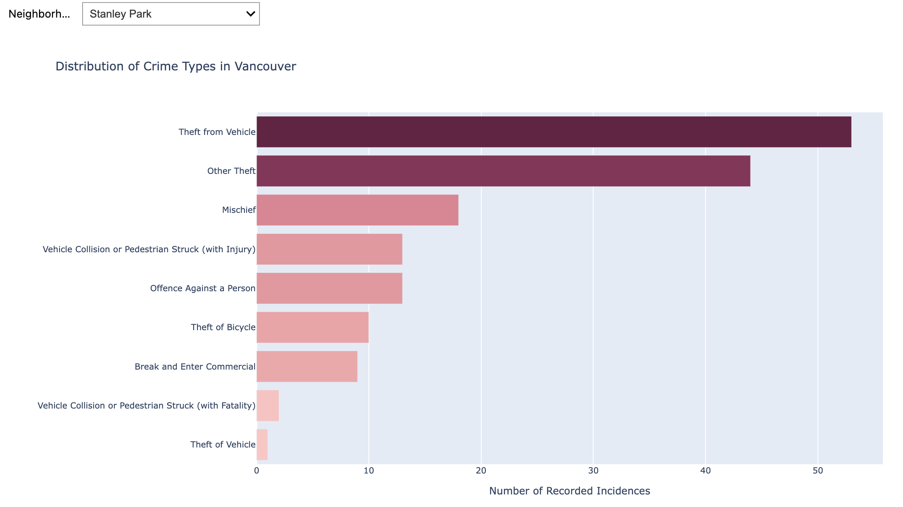
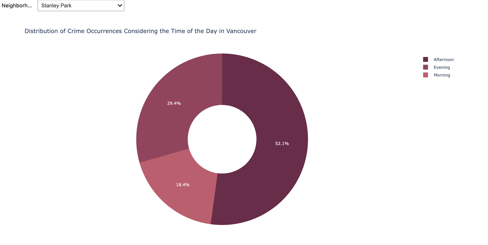

# Proposal - Vancouver Crime Watch

## Section 1: Motivation and Purpose
Briefly explain the "Why":

Target Audience: Who are they and what role are you embodying?
Problem: What challenge are they facing?
Solution: How will your dashboard help them solve it?

## Section 2: Description of the Data
 
**Data set:** *Vancouver Crime Data 2025–2026 – Vancouver Police Department*

The source dataset will contain approximately 36,000 registered crime activities (32,411 occurred during 2025 and 3,000+ for 2026, depending on the cut-off date). It contains 10 attributes detailing the reported crime event activity. Additionally, we plan to derive and augment new variables from the source data, such as crime severity based on the crime “type” (CRIME_SEVERITY), suggested city regions (REGION), and times of day providing “morning”, “afternoon”, and “night” segmentation (PART_OF_DAY). Furthermore, if time permits, we may include a parallel catalogue of population-per-neighbourhood data to calculate crime rates per capita.

We envision making use of most of the variables from the original dataset to provide the visibility and usability proposed for the dashboard: spatial and temporal analysis of crime levels across locations, times of day, and crime categories, as well as analysis of rates across different locations.

Here's a brief description of the 10 default variables:

**TYPE**  
Text field specifying the type of crime activity, as classified by the VPD.

**YEAR**  
Numeric field indicating the year in which the crime activity occurred. Four-digit format.

**MONTH**  
Numeric field indicating the month in which the crime activity occurred. Two-digit format.

**DAY**  
Numeric field indicating the day of the month on which the crime activity occurred. Two-digit format.

**HOUR**  
Numeric field indicating the hour (24-hour notation) at which the crime activity occurred. Two-digit format.

**MINUTE**  
Numeric field indicating the minute at which the crime activity occurred. Two-digit format.

**HUNDRED_BLOCK**  
Masked address indicating the block of the street where the crime activity occurred.  

   **Important:** According to the data source owner, crime activities related to offences against a person were deliberately randomized to certain blocks and offset to intersections. Incidents with unknown locations are indicated as “X NK_LOC ST”.

**NEIGHBOURHOOD**  
Text field specifying the name of the neighbourhood where the crime activity occurred. This field follows the Statistics Canada definition of neighbourhoods within the City of Vancouver, based on the Census Tracts (CT) concept.

**X**  
Offset X-coordinate value where the crime activity occurred, using the UTM Zone 10 projection.

**Y**  
Offset Y-coordinate value where the crime activity occurred, using the UTM Zone 10 projection.

##### Reference:
- Vancouver Police Department (VPD) - Crime Data Download.
- https://geodash.vpd.ca/opendata/

## Section 3: Research Questions & Usage Scenarios
**Persona**

John Smith is a father of two young children who is relocating to Vancouver, Canada for work. He is unfamiliar with the city's neighbourhoods and wants to ensure that he chooses a safe area to rent or buy a home. He understands that the Vancouver Police Department (VPD) has a database of all crime that happens in the city for the whole year, however he does not wish to view raw statistics but would instead prefer clear, visual summaries. John's main concern when looking for a home is neighbourhood safety, particularly crimes that could directly affect his children.

**Usage Scenario**

John is exploring home listings on rental platforms. However, he realizes that he does not recognize most neighbourhood names and has no intuitive sense if they are safe neighbourhoods. He would like to compare neighbourhood safety objectively using actual crime rates, instead of relying solely on subjective opinions from online forums.

Using the dashboard, John can view an interactive map of Vancouver that visually highlights neighbourhoods based on overall crime rates. He can apply filters to focus on specific crime categories that are most relevant to his family’s safety, allowing him to assess which areas may pose greater concern for his young children. John is also able to explore crime patterns by time of day to understand whether incidents tend to occur during the afternoon when his children might be home from school.

The dashboard allows John to narrow his shortlist to neighbourhoods that align with his family’s safety priorities and gives him greater confidence in his housing decision.

**User Stories**

1. **View neighbourhood crime levels on a map**: As a newcomer unfamiliar with Vancouver neighbourhoods, I want to view an interactive map that displays crime levels by neighbourhood so that I can visually compare areas and better understand where higher or lower crime concentrations are located.
2. **Understand crime patterns by time of day**: As a parent with young children, I want to see when crimes most frequently occur (morning, afternoon, evening, night) so that I can assess whether incidents tend to happen during times when my children may be home.
3. **View crime rates adjusted for neighbourhood population size**: As someone comparing neighbourhoods of different sizes, I want to see crime rates normalized by population so that I can make fair comparisons between larger and smaller areas.

## Section 4: Exploratory Data Analysis
To address User Story 2 (**Understand crime patterns by time of day**), we analyzed how crime occurrences are distributed across different periods and categories within Vancouver's neighborhood.

### 4.1 Context:
John has heard wonderful stories about Stanley Park, its lush greenery and walkways make it a dream location for his wife and two children, who love to walk and bike. However, John values data over hearsay. He wants to ensure the reality of the neighborhood matches its reputation.

### 4.2 Analysis
By filtering the VPD dataset specifically for Stanley Park in [notebooks/eda_analysis.ipynb]--(Update-remember to insert the link here)--, we can see two critical trends that could influence his decision:

- **Crime Type Distribution**: The bar chart shows that `Theft from Vehicle` is the most frequent occurrence. For a father of two, this provides a practical warning about his vehicle and a clear signal to prioritize secure parking. Also, `Offence Against a Person` ranks lower, suggesting that while vehicle crime is a factor, physical safety for pedestrians is somewhat higher, an indicator for a family who loves walking.

  

- **Daily Patterns**: The donut chart shows a heavy skew toward the Afternoon (52.1%), with the Morning (18.4%) having the lowest value. John now knows that if **he’s considering residence in this neighborhood, he must be extra vigilant about securing his vehicle and belongings** during the peak hours.

  

### 4.3 Reflection
This data supports John’s decision-making by replacing `"wonderful stories"` with actionable insights. Knowing that over half of the incidents occur in the afternoon allows John to be more `"street smart"`. For example, ensuring no bags are left visible in the car during their afternoon bike rides, or even obtaining solid car locks.
The dashboard demonstrates that while Stanley Park has high property crime (theft), it maintains a profile that might still be acceptable for John’s family priorities. This analysis proves our dashboard can help a newcomer objectively compare their lifestyle needs against observed security and crime patterns.

## Section 5: App Sketch & Description

The landing page of the dashboard opens provides a high-level overview of crime patterns across Vancouver neighbourhoods, featuring KPI cards that summarize total incidents, crime rate, city average comparison, and month-over-month change. Users can apply filters on the left panel to select neighbourhood, crime type, month, and time of day to update the visuals accordingly. The heat map of the City of Vancouver provides geographic context by highlighting crime intensity across neighbourhoods. The supporting charts display different metrics that are useful for the user (i.e. crime counts by type and the distribution of incidents by time of day). Together, this dashboard allow users to explore safety trends in the City of Vancouver to support informed housing decisions.