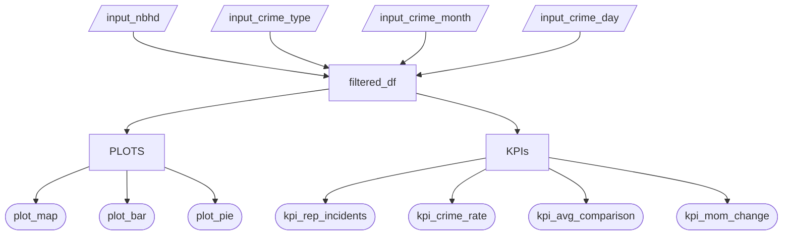

# Updated Job Stories

# Component Inventory

# Reactivity Diagram

```mermaid 
flowchart TD
    A[/input_nbhd/] --> F[filtered_df]
    B[/input_crime_type/] --> F
    C[/input_crime_month/] --> F
    D[/input_crime_day/] --> F
    
    F --> PLOTS[PLOTS]
    F --> KPIS[KPIs]

    PLOTS --> P1([plot_map])
    PLOTS --> P2([plot_bar])
    PLOTS --> P3([plot_pie])
    KPIS --> K1([kpi_rep_incidents])
    KPIS --> K2([kpi_crime_rate])
    KPIS --> K3([kpi_avg_comparison])
    KPIS --> K4([kpi_mom_change])
```

# Calculation Details