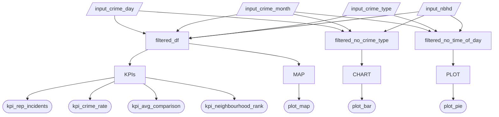

# Updated Job Stories

| #   | Job Story                       | Status         | Notes                         |
| --- | ------------------------------- | -------------- | ----------------------------- |
| 1   | As a newcomer unfamiliar with Vancouver neighbourhoods, I want to view an interactive map that displays crime levels by neighbourhood so that I can visually compare areas and better understand where higher or lower crime concentrations are located. | ✅ Implemented |                               |
| 2   | As a parent with young children, I want to see when crimes most frequently occur (morning, afternoon, evening, night) so that I can assess whether incidents tend to happen during times when my children may be home. | ✅ Implemented |  |
| 3   | As someone comparing neighbourhoods of different sizes, I want to see crime rates normalized by population so that I can make fair comparisons between larger and smaller areas. | ✅ Implemented  |                               |
| 4   | As someone relocating to a new city and unfamiliar with its neighbourhoods, I want to see how a neighbourhood ranks in safety compared to other areas so that I can quickly understand whether it is relatively safer or riskier when making a housing decision. | ✅ Implemented  |                               |
| 5   | As someone exploring crime patterns in Vancouver, I want to see the top five crime types based on my selected neighbourhood, month, and time-of-day filters (excluding crime type itself) so that I can quickly understand which offences are most prevalent under those conditions. | ✅ Implemented  | Included this in M2 as per internal discussion around a more significan bar chart. |

# Component Inventory

| ID                        | Type      | Shiny widget / renderer | Depends on                                                | Job Story |
|---------------------------|-----------|--------------------------|-----------------------------------------------------------|-----------|
| `input_nb`                | Input     | `ui.input_select()`      | —                                                         | #1, #3, #4 |
| `input_crime_type`        | Input     | `ui.input_select()`      | —                                                         | #1, #2, #3 |
| `input_month`             | Input     | `ui.input_select()`      | —                                                         | #2        |
| `input_daily_time`        | Input     | `ui.input_select()`      | —                                                         | #2        |
| `crime_count`             | Output    | `@render.text`           | `filtered_data()`                                        | #1        |
| `crime_rate`              | Output    | `@render.text`           | `filtered_data()`, `filtered_population()`               | #3        |
| `average_comparison`      | Output    | `@render.ui`             | `filtered_data()`, `filtered_population()`               | #3        |
| `neighbourhood_rank`      | Output    | `@render.text`           | `neighbourhood_rank_calc()`                              | #4        |
| `crime_map`               | Output    | `@render.ui`             | `neighbourhood_rates()`, `input_nb`, `filtered_latlon`, `selected_neigh_bounds`| #1|
| `top_crime_type_bar`      | Output    | `@render_widget`         | `top_crime_types()`                              | #1        |
| `filtered_data`           | Reactive  | `@reactive.calc`         | `input_nb`, `input_crime_type`, `input_month`, `input_daily_time` | #1, #2, #3 |
| `filtered_population`     | Reactive  | `@reactive.calc`         | `input_nb`                                               | #3        |
| `neighbourhood_ranking`.  | Reactive  | `@reactive.calc`         | `input_crime_type`, `input_month`, `input_daily_time`, `input_nb`    | #4        |
| `neighbourhood_rates`     | Reactive  | `@reactive.calc`         | `filtered_data()`                                          | #1        |
| `filtered_latlon`         | Reactive  | `@reactive.calc`         | `filtered_data()`                                          | #1        |
| `selected_neigh_bounds`   | Reactive  | `@reactive.calc`         | `filtered_data()`, `neigh_gdf`                             | #1        |
| `filetered_data_no_crime_type`   | Reactive  | `@reactive.calc`   | `filtered_data()`, `neigh_gdf`                      | #5        |
| `top_crime_types`         | Reactive  | `@reactive.calc`         | `filetered_data_no_crime_type()` | #5        |

# Reactivity Diagram

# Calculation Details

| Reactive Calculation      | Inputs it Depends On | Transformation Performed | Outputs Consuming Reactive Calculation |
|---------------------------|---------------------|--------------------------|----------------------------------------|
| `filtered_data()` | `input.nb`, `input.crime_type`, `input.month`, `input.daily_time` | Filters the crime dataset to match the selected neighbourhood, crime type, month, and time-of-day selections. | `crime_count`, `crime_rate`, `average_comparison` |
| `filtered_population()` | `input.nb` | Returns the population of the selected neighbourhood. | `crime_rate`, `average_comparison` |
| `neighbourhood_ranking()` | `input.nb`, `input.crime_type`, `input.month`, `input.daily_time` | Applies the selected filters, calculates crime counts per neighbourhood then converts them into population-adjusted crime rates. Returns the rank of the neighbourhoods sorted by crime rate. | `neighbourhood_rank` |
| `neighbourhood_rates`      | `filtered_data()` | Aggregates incidents by neighbourhood, join population data, and computes crime rate per 1000 residents. | `crime_map`  |
| `filtered_latlon`      | `filtered_data()` | Cleans X/Y coordinates, converts from UTM (EPSG:32610) to WGS84 lat/lon (EPSG:4326), and filters to valid geographic bounds. | `crime_map`  |
| `selected_neigh_bounds`      | `filtered_data()`, `neigh_gdf`  | Extracts selected neighbourhood polygon and computes bounding box coordinate to zoom in the map. | `crime_map`  |
| `filetered_data_no_crime_type`      | `filtered_data()`, `neigh_gdf`  | Applies neighbourhood, month, and time-of-day filters while intentionally excluding the crime type filter. | `top_crime_types`  |
| `top_crime_types`      | `filetered_data_no_crime_type()` | Groups incidents by crime type, counts occurrences, sorts descending, and selects the top five categories. | `top_crime_type_bar`  |
